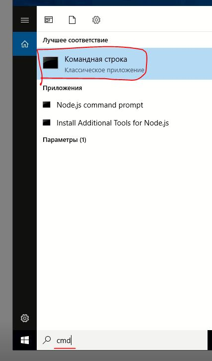
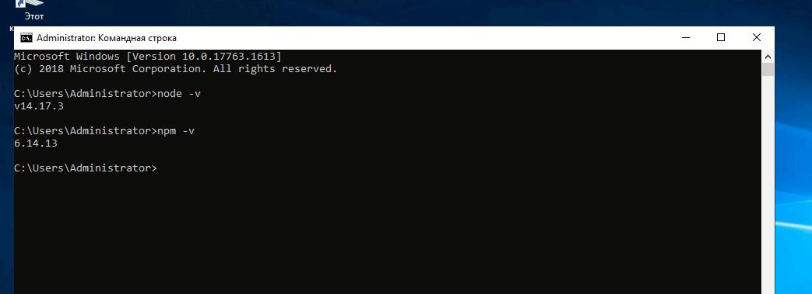
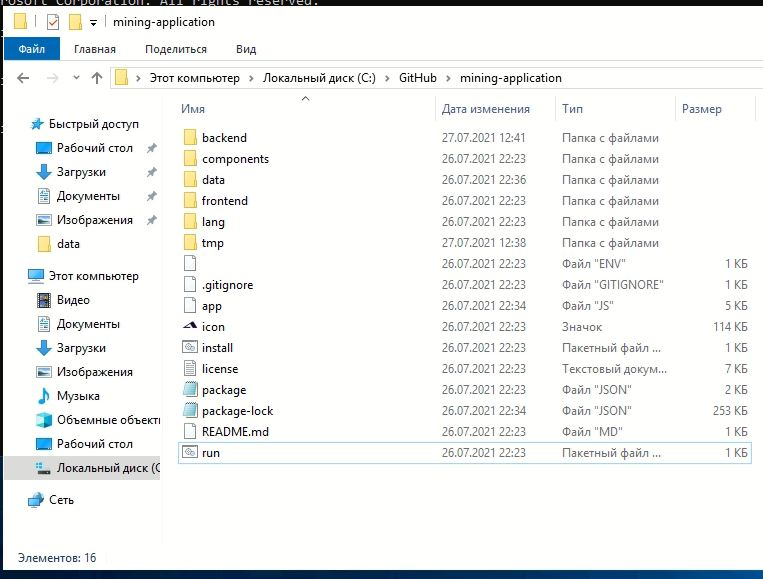
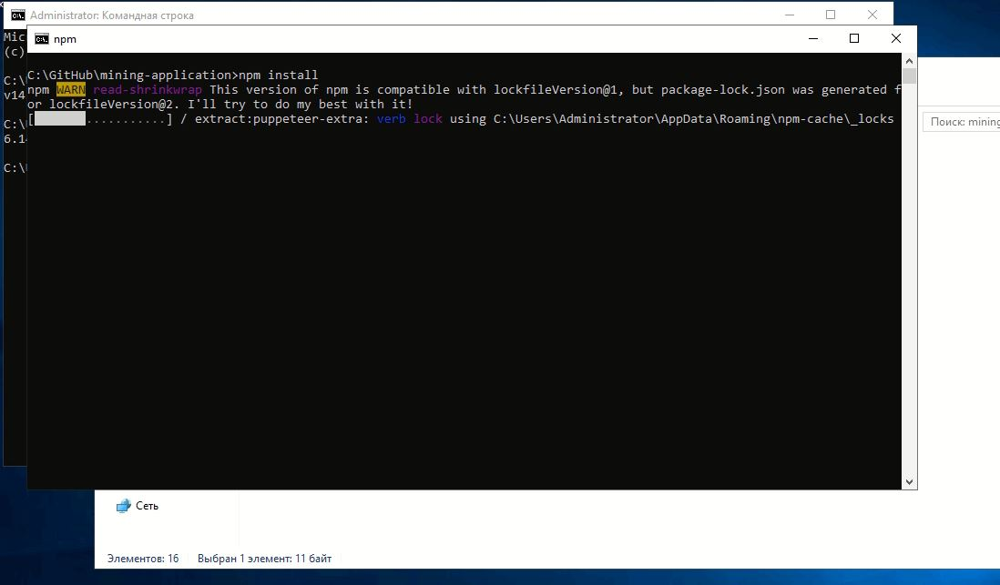
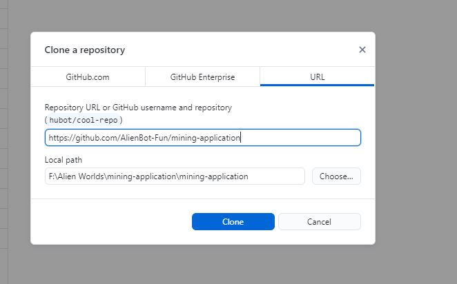
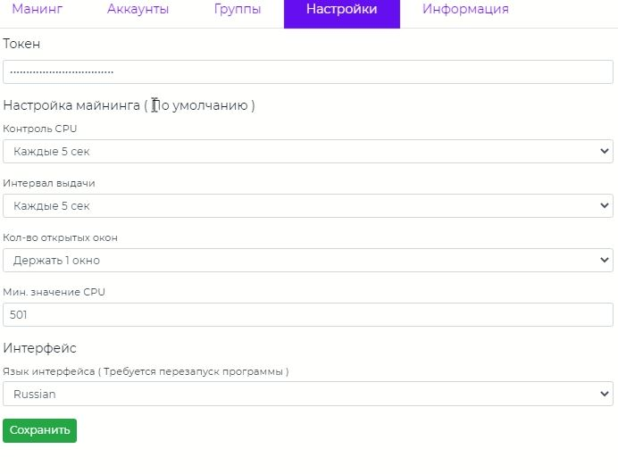
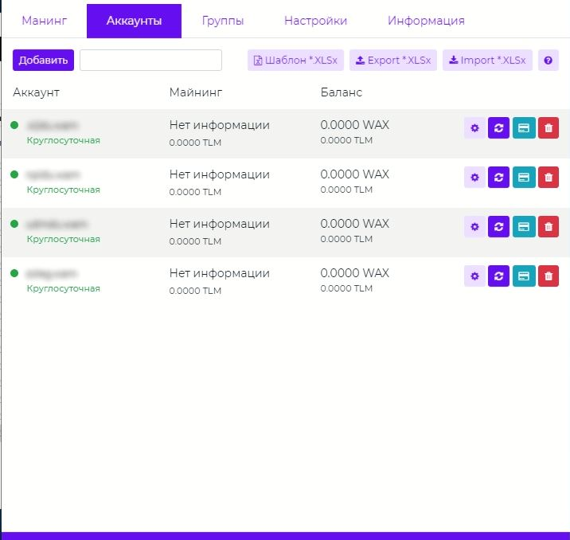
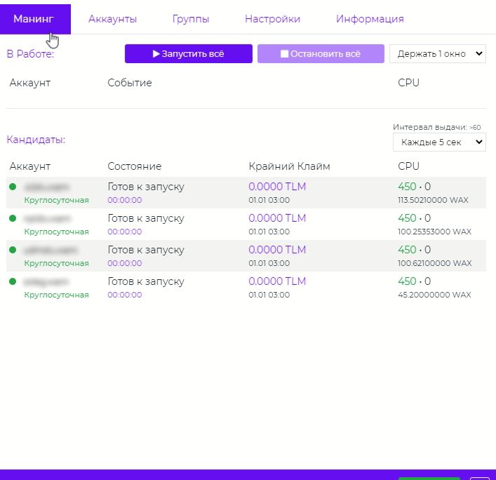

# Alien BOT - Майнинг триллиума
play.alienworlds.io alienworlds alien-worlds alien worlds alien bot AlienBot

---

## Требования к железу
- OS: Windows 10 / Дедик Windows 10 ( 2019 )
- x64 Разрядная система
- CPU: Мин: 4 Core / Рекоменд. 6 Core
- RAM: Мин: 4 Gb / Рекоменд. 6 Gb
- Хороший интернет

## Установка
### 1. Установка NODEjs
Первым делом качаем и устанавливаем его на компьютер
Ссылка на скачивание: https://nodejs.org/dist/v14.17.3/node-v14.17.3-x64.msi

> Что бы проверить работает ли NODEjs, нужноно открыть поиск, набрать `cmd` и открыть командную строку.  

> В открытом черном окне набрать  `node -v` и `npm -v`. Если там примерно как на фото ниже, значит всё порядок - ваш компьютер "готов" к установке программы

### 2. Загрузка исходников
Существует два способа згрузки программы и отслеживания обновлений:

- 1. **Загрузка и распаковка архива** крайней версии ( Обновление метом загрузки новых версий и переносом данных аккунтов, групп и настроек )
- 2. **Загрузка репозитория** и переодическая отгрузка мелких изменений через программу GitHub Desktop.

У каждого способа есть свои плюсы и минусы. Для стабильной работы используйте первый вариант. Второй вариант нестабильный!, однако именно в нём в первую очередь появляются нововведения.

### 2.1 Загрузка исходников и распаковка архива ( 1 СПОСОБ )

Для начала необходимо распаковать крайнию версию репозитория в любое место на компьютере. Рекомендуем поближе к корню диска С: 

- [Скачать крайнию версию](https://github.com/AlienBot-Fun/mining-application/releases/latest)

- [Другие версии](https://github.com/AlienBot-Fun/mining-application/releases)

Далее распаковываем архив и видим примерно вот такой список файлов:

!Первым делом, необходимо ~~загрузить зависимые пакеты для работы~~ установить эту программу. Для этого необходимо запустить пакетный файл `install` и дождаться пока там все установиться и само окно с установкой закроется по окончанию.

Далее, запускаем пакетный файл `run`. После чего мы увидим интерфейс программы. Чёрное окно консоли сворачиваем. А сами переходим к пункту настройки программы 
( Пункт 3. ).

### 2.2 Загрузка репозитория ( 2 СПОСОБ )

Для начала необходимо скачать программу `GITHUB DESKTOP` для удобства обновления программы: [Скачать](https://desktop.github.com/)

Установить программу и запустить её. В окне программы нажать `file -> clone repository...`. Переключиться во вкладу `URL` и вставить адрес этого репозитория `https://github.com/AlienBot-Fun/mining-application` и ниже указать путь для установки.

Далее после того как программа `GITHUB DESKTOP` распакует репозиторий мы увидим примерно вот такой список файлов:

!Первым делом, необходимо ~~загрузить зависимые пакеты для работы~~ установить эту программу. Для этого необходимо запустить пакетный файл `install` и дождаться пока там все установиться и само окно с установкой закроется по окончанию.

Далее, запускаем пакетный файл `run`. После чего мы увидим интерфейс программы. Чёрное окно консоли сворачиваем. А сами переходим к пункту настройки программы ( Пункт 3. ).

### 3. Настройка программы

!Первым делом идем во вкладку настройки и вбиваем свой токен. Его можно получить зарегистрировавшись на сайте: [AlienBot.fun](https://alienbot.fun)

- **_Интервал выдачи:_** это время которую программа бует выжидать прежде чем отправить следующий аккаунт майнить ( Рекомендуем использовать от 10 секунд если не используете прокси )

- **_Кол-во открытых окон:_** это кол-во потоков доступных для майнинга. Чем больше потоков, тем мощнее требуется машина и выше шанс нарваться на ~~CloudFire~~ блокировщик соединений 

- **_Мин знач. CPU:_** это кол-во CPU на аккаунте при котором будет совершаться попытка подписывания транзакции, оно-же будет выставляться по умолчанию при добавлении новых аккаунтов ( Именно по тем значениям будет совершаться попытка ).

- **_Язык интерфейса:_** это языковой перевод. Файл в папке `lang`. Можете переделать под себя создав копию файла с другим названием. Предворительно впишите это название в соседний файл `langs.json`

### 4. Загрузка аккаунтов
Аккаунты можно добавлять по одному через кнопку `добавить`. Или можно скачать `файл шаблона`(Кнопка Шаблон) и при помощи программы `excel` собрать список аккаунтов и `импортировать`(Кнопка Import) его в программу AlienBot (Формат файла *.xlsx). В файле шаблона есть пример строк как заполнять его. 

В списке аккаунтов станет доступно вход в свой кошелёк "одним кликом", НО! предворительно получите ТОКЕН сессии ( две круговые стрелочки )

### 5. Майнинг

Для майнинга, нажмите на кнопку `Запустить всё`.

В окне майнинга доступно два выпадающих списка ( О них говорилось ранее в настройках ). Значения по умолчанию беруться оттуда же. При изменении значений этих списков - значения в самих настройках перезапысываться не будут, т.к. эти рычаги работают для текущего сеанса. Идите в настройки что бы менять умолчания для них.

При нажатии `Остановить всё` программа перестанет выдавать задание на майнинг, список аккаунтов в работе начнёт уменьшатся, программа дожидается пока задания завершат свою работу и тем самым майнинг завершится.

Используйте свёрнутую консоль что бы завершать работу программы и не видеть иногда ошибки от ноющих браузеров :)

### Примечание по конфиденциальности

# **Мы не скачиваем и не храним доступы от почты, реддита, аккаунтов ВАКС и другие какие либо данные которые вы вбиваете в эту программу.**

Единственное что мы знаем, это логины аккаунтов которые вы вбиваете в программу и сам факт совершения успешного клайма( или неудачного клайма ). Остальные данные мы берем с блокчейна( именно публичные данные ). На их основе мы собираем статистику, которая позже вам же, как хороший бонус.

**Таже самая политика касается в случае, если вы сами предоставляете нам свои конфидициальные и другие личные данные для анализа технических трудностей в частном порядке.** Убедительно просим Вас не беспокоиться за это.

# **Софт не содержит вирусов** и не способен как либо навредить вам, вашем кошельку или железу. 

Используйте эту инструкцию и сам софт разумно.

**Приятного майнинга!**